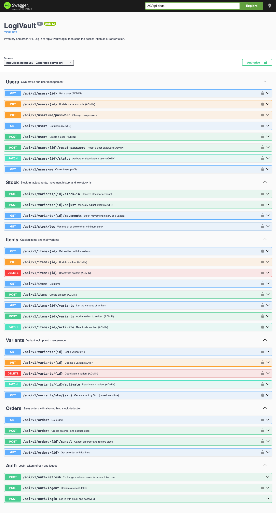
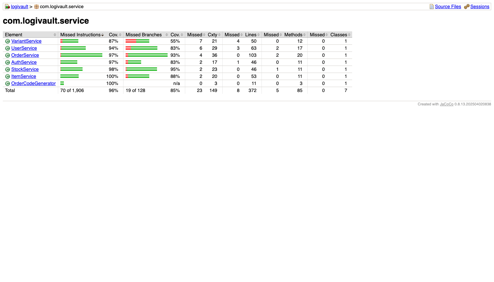
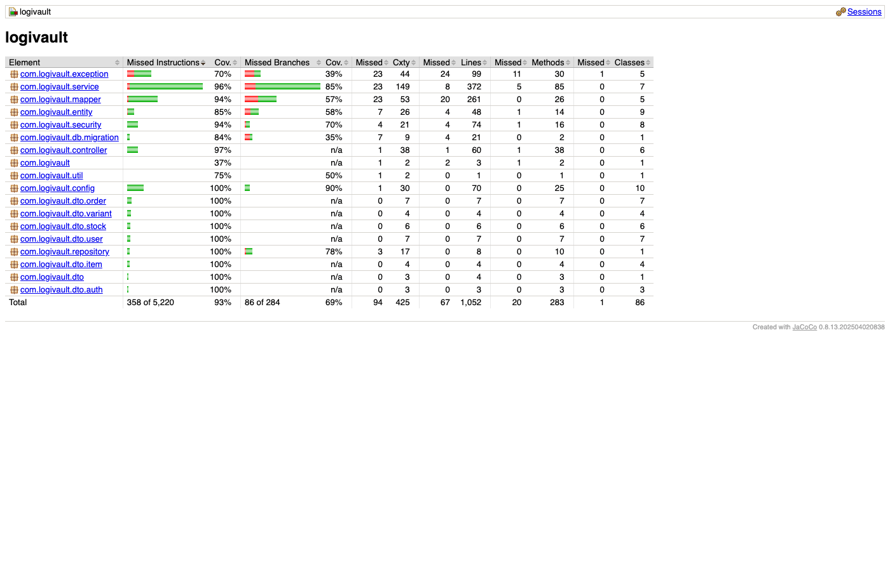

# LogiVault Backend

REST API for a shop's warehouse inventory: items, variants, prices, stock and sales orders. It refuses to sell stock the shop does not have, even under concurrent sales, and keeps a full history of every stock change.

**About the name:** *LogiVault* combines **Logistics** and **Vault** (a secure place to keep valuables). The name reflects what the system aims to be: a logistics system that is secure, accurate and keeps high data integrity when tracking stock.

**Stack:** Java 21 · Spring Boot 3.5 · PostgreSQL 16 · Spring Data JPA · Flyway · Spring Security + JWT · MapStruct · Lombok · springdoc (OpenAPI / Swagger UI) · JUnit 5 + Testcontainers · JaCoCo

## Contents
1. [How to run the application](#1-how-to-run-the-application)
2. [Design decisions](#2-design-decisions)
3. [Assumptions](#3-assumptions)
4. [API endpoints](#4-api-endpoints)
5. [API examples](#5-api-examples)
6. [Tests and coverage](#6-tests-and-coverage)
7. [Project structure](#7-project-structure)

---

## 1. How to run the application

### Prerequisites
| Tool | Version | Check |
|---|---|---|
| JDK | 21 | `java -version` |
| Docker Desktop | any recent, running | `docker ps` |

Maven is not required: the project ships the Maven wrapper (`./mvnw`).

### Steps
```bash
# 1. Configure secrets
cp .env.example .env
openssl rand -base64 48         # paste the output as JWT_SECRET in .env
                                # also set DB_PASSWORD and LOGIVAULT_ADMIN_PASSWORD

# 2. Start PostgreSQL 16 (host port 5433)
docker compose up -d db

# 3. Run the API (dev profile by default, reads .env automatically)
./mvnw spring-boot:run
```

On first start, Flyway creates the schema (`V1__init_schema.sql`) and seeds the first ADMIN account from `LOGIVAULT_ADMIN_EMAIL` / `LOGIVAULT_ADMIN_PASSWORD` (`V2__SeedAdmin`).

Check that it is up:
```bash
curl http://localhost:8080/actuator/health
# {"status":"UP"}
```

| URL | What |
|---|---|
| http://localhost:8080/api/v1 | API base |
| http://localhost:8080/swagger-ui.html | Swagger UI (dev profile only) |
| http://localhost:8080/v3/api-docs | OpenAPI 3.1 spec (dev profile only) |
| http://localhost:8080/actuator/health | Health check |

### Environment variables
| Name | Default | Purpose |
|---|---|---|
| `DB_HOST` / `DB_PORT` / `DB_NAME` | `localhost` / `5433` / `logivault` | Database location |
| `DB_USERNAME` / `DB_PASSWORD` | `logivault` / – | Database credentials (required) |
| `JWT_SECRET` | – | Base64 HMAC key, at least 32 bytes (required) |
| `LOGIVAULT_ADMIN_EMAIL` / `LOGIVAULT_ADMIN_PASSWORD` | – | First ADMIN account, created on first start |
| `LOGIVAULT_CORS_ALLOWED_ORIGINS` | empty | Comma-separated allowed origins; empty disables CORS |

### Profiles
| Profile | Use | Differences |
|---|---|---|
| `dev` (default) | Local development | Swagger UI and `/v3/api-docs` enabled, SQL logging |
| `prod` | Deployment | API docs disabled, only `/actuator/health` exposed, no health details |
| `test` | Automated tests | Used by Testcontainers-based integration tests |

### Using Swagger UI
1. Open http://localhost:8080/swagger-ui.html.
2. Expand **Auth → POST /api/v1/auth/login**, click **Try it out**, send the admin email and password.
3. Copy `accessToken` from the response, click **Authorize** (top right) and paste it.
4. Every endpoint with a lock icon now sends `Authorization: Bearer <token>`.



---

## 2. Design decisions

### Stock correctness
| Decision | Why |
|---|---|
| **One write path for stock.** `StockService.applyMovement` is the only code that changes `Variant.stock`. It requires an existing transaction (`Propagation.MANDATORY`). | Stock-in, adjustments, sales and cancellations all follow the same rules, so the ledger and the stock column can never drift apart. |
| **Pessimistic row locks** (`SELECT ... FOR UPDATE`) on the variants of an order, always taken in a fixed order (sorted by id). | Two cashiers selling the last unit at the same moment must not both succeed. Locking in a fixed order prevents deadlocks when two orders touch the same variants in opposite order (`OrderConcurrencyIT` checks both cases). |
| **All-or-nothing orders.** If any line is short, the whole order fails with `409 INSUFFICIENT_STOCK` and nothing is deducted. The response lists every short line with `requested` and `available`. | A half-fulfilled sale is worse than a failed one at a till. The client can show exactly what is missing. |
| **Immediate deduction, no reservation.** Creating an order is the sale. | Matches an in-store POS flow; reservation and pending orders are out of scope for V1. |
| **Append-only ledger** (`stock_movements`) with type, signed qty, stock before and after, reason, actor and order reference. | Answers "who changed this stock, when, why, and what was it after?". Current stock always equals the replayed sum of the ledger (`LedgerInvariantIT`). |
| **Database `CHECK (stock >= 0)`** as a last line of defense. | Even a bug in the service layer cannot persist negative stock; the violation maps to `INSUFFICIENT_STOCK`. |
| **Cancel restores stock** with a `SALE_CANCEL` movement per line and requires a reason. Orders are never edited. | Keeps the history honest. To fix an order, cancel it and create a new one. |

### Catalog
| Decision | Why |
|---|---|
| Item → Variant model. Price and stock live on the variant; `variant.price` is optional and falls back to `item.basePrice` (`effectivePrice`). | Most variants of a product share a price; only exceptions need their own. |
| An item created without variants gets a `Default` variant with an auto-generated SKU. | Every sellable thing is a variant, so orders and stock only deal with one concept. |
| SKU is unique (case-insensitive) and becomes immutable once stock movements exist (`SKU_IMMUTABLE`). | SKUs printed on labels and referenced in history must not change underneath them. |
| Soft delete (`DELETE` sets `active = false`, `PATCH .../activate` restores). Inactive variants cannot be sold or stocked (`422 VARIANT_INACTIVE`). | Orders and movements keep referencing the variant, so rows are never physically removed. |
| Variant attributes stored as PostgreSQL `JSONB` (`{"size":"M","color":"Hitam"}`). | Flexible per product without extra tables. |

### API and security
| Decision | Why |
|---|---|
| Stateless JWT access tokens (15 min) plus refresh tokens (7 days). Refresh tokens are stored only as SHA-256 hashes and rotated on every refresh; logout revokes them. | Short-lived access tokens limit damage if leaked; a stolen DB dump does not expose usable refresh tokens. |
| Two roles: `ADMIN` (catalog, adjustments, users) and `STAFF` (sell, cancel, stock-in, read). ADMIN rules are enforced as URL rules **and** `@PreAuthorize`. | URL rules run before request validation, so STAFF always gets `403`, never a `400` that leaks the request shape. `@PreAuthorize` is a second layer. `RoleMatrixIT` checks every endpoint for every role (117 cases). |
| Errors use RFC 7807 `ProblemDetail` with an extra stable `code` field (`INSUFFICIENT_STOCK`, `SKU_ALREADY_EXISTS`, ...) and `errors[]` for validation. Security 401/403 return the same shape. | Clients branch on `code`, not on English messages. One error shape everywhere. |
| UUID primary keys. | Ids are not guessable and can be generated without a DB round trip. |
| Order codes `ORD-YYYYMMDD-NNNN`, numbered per business day in `Asia/Jakarta`, from a counter table. | Human-readable for receipts; per-day counters avoid gaps from sequences. |
| All timestamps stored in UTC (`Instant`); business dates use `Asia/Jakarta`. Time comes from an injected `Clock`. | Correct "today" boundaries for a shop in Indonesia, and deterministic tests. |
| One stable paging shape: `content`, `page`, `size`, `totalElements`, `totalPages`; max page size 100. | Does not leak Spring's `Page` JSON, which changes between versions. |
| Package-by-layer (`controller`, `service`, `repository`, `entity`, `dto`, `mapper`, ...) with a feature prefix on class names. | Familiar Spring layout; one feature is still found by name (`Order*`). |
| Schema managed only by Flyway (`ddl-auto: validate`). MapStruct with `unmappedTargetPolicy=ERROR`. | The schema is reviewed SQL, not guessed by Hibernate. A new field that is not mapped fails the build instead of silently returning `null`. |
| OpenAPI generated from code (springdoc) with summaries, error responses and examples; Swagger UI only in `dev`. | Docs cannot go stale, and production does not expose the API surface. |

---

## 3. Assumptions
- One shop, one warehouse, one currency (IDR). Business timezone `Asia/Jakarta`.
- Clients are trusted internal apps (admin panel, POS) on a private or HTTPS network. There is no public sign-up; an ADMIN creates users and resets passwords.
- Stock is counted in whole units. No fractional quantities, batches or expiry dates.
- Payment happens outside LogiVault. A created order means the sale already happened.
- Cancelling an order voids a mistaken sale. Real customer returns and partial refunds are out of scope.
- `minStock` defaults to 5 per variant. A variant is "low stock" when `stock <= minStock`.
- Expected volume for V1: up to 5,000 variants, 1,000 orders per day, 50 concurrent users.
- Both ADMIN and STAFF can see all orders and cancel any order.
- A deactivated user can no longer log in or refresh, but an access token already issued stays valid until it expires (max 15 minutes).
- Login lockout after repeated failures is designed (`429 TOO_MANY_ATTEMPTS`) but deferred; there is no brute-force protection yet.
- Out of scope for V1: multiple warehouses, suppliers and purchase orders, discounts and taxes, notifications, reports and exports, and a frontend.

---

## 4. API endpoints

Base path `/api/v1`. All endpoints except login and refresh require `Authorization: Bearer <accessToken>`.
"Any" means any logged-in user (ADMIN or STAFF).

### Auth
| Method | Path | Role | Description |
|---|---|---|---|
| POST | `/auth/login` | public | Log in with email and password |
| POST | `/auth/refresh` | public | Exchange a refresh token for a new token pair |
| POST | `/auth/logout` | Any | Revoke a refresh token |

### Items
| Method | Path | Role | Description |
|---|---|---|---|
| POST | `/items` | ADMIN | Create an item (with variants, or a Default variant) |
| GET | `/items?q=&active=&page=&size=&sort=` | Any | List items |
| GET | `/items/{id}` | Any | Item with its variants |
| PUT | `/items/{id}` | ADMIN | Update name, description, base price |
| DELETE | `/items/{id}` | ADMIN | Deactivate an item |
| PATCH | `/items/{id}/activate` | ADMIN | Reactivate an item |
| GET | `/items/{id}/variants` | Any | List the variants of an item |
| POST | `/items/{id}/variants` | ADMIN | Add a variant |

### Variants
| Method | Path | Role | Description |
|---|---|---|---|
| GET | `/variants/{id}` | Any | Variant detail |
| GET | `/variants/sku/{sku}` | Any | Lookup by SKU (case-insensitive) |
| PUT | `/variants/{id}` | ADMIN | Update a variant |
| DELETE | `/variants/{id}` | ADMIN | Deactivate a variant |
| PATCH | `/variants/{id}/activate` | ADMIN | Reactivate a variant |

### Stock
| Method | Path | Role | Description |
|---|---|---|---|
| POST | `/variants/{id}/stock-in` | Any | Receive stock |
| POST | `/variants/{id}/adjust` | ADMIN | Manual adjustment (signed `delta`, reason required) |
| GET | `/variants/{id}/movements?type=&from=&to=` | Any | Stock movement history |
| GET | `/stock/low` | Any | Variants at or below their minimum stock |

### Orders
| Method | Path | Role | Description |
|---|---|---|---|
| POST | `/orders` | Any | Create an order and deduct stock (all or nothing) |
| POST | `/orders/{id}/cancel` | Any | Cancel an order and restore stock |
| GET | `/orders?status=&from=&to=&createdBy=` | Any | List orders |
| GET | `/orders/{id}` | Any | Order with its lines |

### Users
| Method | Path | Role | Description |
|---|---|---|---|
| GET | `/users/me` | Any | Own profile |
| PUT | `/users/me/password` | Any | Change own password |
| GET | `/users?q=&role=&active=` | ADMIN | List users |
| POST | `/users` | ADMIN | Create a user |
| GET | `/users/{id}` | ADMIN | Get a user |
| PUT | `/users/{id}` | ADMIN | Update name and role |
| PATCH | `/users/{id}/status` | ADMIN | Activate or deactivate (not yourself) |
| POST | `/users/{id}/reset-password` | ADMIN | Reset a user's password |

### Error codes
| HTTP | `code` |
|---|---|
| 400 | `VALIDATION_ERROR`, `INVALID_OLD_PASSWORD` |
| 401 | `UNAUTHORIZED`, `INVALID_CREDENTIALS`, `INVALID_REFRESH_TOKEN` |
| 403 | `FORBIDDEN` |
| 404 | `USER_NOT_FOUND`, `ITEM_NOT_FOUND`, `VARIANT_NOT_FOUND`, `ORDER_NOT_FOUND` |
| 409 | `EMAIL_ALREADY_EXISTS`, `SKU_ALREADY_EXISTS`, `SKU_IMMUTABLE`, `INSUFFICIENT_STOCK`, `INVALID_ORDER_STATUS`, `SELF_MODIFICATION_NOT_ALLOWED`, `CONCURRENT_MODIFICATION` |
| 422 | `VARIANT_INACTIVE` |
| 429 | `TOO_MANY_ATTEMPTS` (reserved for login lockout) |
| 500 | `INTERNAL_ERROR` |

---

## 5. API examples

The examples below are real responses captured from a local run, following the main flow: **login → create item → stock-in → order → insufficient stock → cancel → history**. Ids will differ on your machine.

```bash
BASE=http://localhost:8080/api/v1
```

### 5.1 Login
```bash
curl -s -X POST $BASE/auth/login \
  -H 'Content-Type: application/json' \
  -d '{"email":"admin@logivault.local","password":"<LOGIVAULT_ADMIN_PASSWORD>"}'
```
```json
{
  "accessToken": "eyJhbGciOiJIUzI1NiJ9...",
  "refreshToken": "<43-char random token>",
  "tokenType": "Bearer",
  "expiresIn": 900,
  "user": { "id": "a23cc587-dfa5-4ef3-b62a-86de33ca5469", "name": "Administrator", "email": "admin@logivault.local", "role": "ADMIN" }
}
```
```bash
TOKEN=<accessToken from the response>
```

### 5.2 Create an item with two variants (ADMIN)
The first variant has no own price, so it uses the item's `basePrice`.
```bash
curl -s -X POST $BASE/items \
  -H "Authorization: Bearer $TOKEN" -H 'Content-Type: application/json' \
  -d '{
    "name": "Kaos Polos",
    "description": "Cotton combed 30s",
    "basePrice": 75000,
    "variants": [
      { "sku": "KAOS-M-HITAM", "name": "M / Hitam", "attributes": {"size":"M","color":"Hitam"}, "minStock": 5 },
      { "sku": "KAOS-L-PUTIH", "name": "L / Putih", "attributes": {"size":"L","color":"Putih"}, "price": 80000, "minStock": 5 }
    ]
  }'
```
`201 Created`, `Location: /api/v1/items/{id}`
```json
{
  "id": "ca391308-c63d-4f3e-a0b9-da75baf7e0e6",
  "name": "Kaos Polos",
  "description": "Cotton combed 30s",
  "basePrice": 75000,
  "active": true,
  "variants": [
    {
      "id": "4e0abfad-61dd-4df6-bf6f-978629368570",
      "sku": "KAOS-M-HITAM",
      "name": "M / Hitam",
      "attributes": { "size": "M", "color": "Hitam" },
      "price": null,
      "effectivePrice": 75000,
      "stock": 0,
      "minStock": 5,
      "lowStock": true,
      "active": true
    },
    {
      "id": "530eb6ad-112c-4734-ad04-a30780843eff",
      "sku": "KAOS-L-PUTIH",
      "name": "L / Putih",
      "attributes": { "size": "L", "color": "Putih" },
      "price": 80000,
      "effectivePrice": 80000,
      "stock": 0,
      "minStock": 5,
      "lowStock": true,
      "active": true
    }
  ],
  "createdAt": "2026-10-01T15:42:50.033969Z",
  "updatedAt": "2026-10-01T15:42:50.033969Z"
}
```

### 5.3 Stock-in
```bash
VARIANT=4e0abfad-61dd-4df6-bf6f-978629368570
curl -s -X POST $BASE/variants/$VARIANT/stock-in \
  -H "Authorization: Bearer $TOKEN" -H 'Content-Type: application/json' \
  -d '{"qty":50,"note":"Supplier delivery"}'
```
`200 OK`
```json
{
  "variantId": "4e0abfad-61dd-4df6-bf6f-978629368570",
  "sku": "KAOS-M-HITAM",
  "stock": 50,
  "movement": {
    "id": "5a4a6382-96c7-481d-b95b-f72ebec56ae5",
    "type": "STOCK_IN",
    "qty": 50,
    "stockBefore": 0,
    "stockAfter": 50,
    "reason": "Supplier delivery",
    "orderCode": null,
    "actor": { "id": "a23cc587-dfa5-4ef3-b62a-86de33ca5469", "name": "Administrator" },
    "createdAt": "2026-10-01T15:42:50.101524Z"
  }
}
```

### 5.4 Create an order
```bash
curl -s -X POST $BASE/orders \
  -H "Authorization: Bearer $TOKEN" -H 'Content-Type: application/json' \
  -d '{"lines":[{"variantId":"'$VARIANT'","qty":2}],"note":"Pickup at 3pm"}'
```
`201 Created`, `Location: /api/v1/orders/{id}`
```json
{
  "id": "043c4f9f-c0c9-46ee-94dc-20515249187c",
  "code": "ORD-20261001-0001",
  "status": "COMPLETED",
  "total": 150000.0,
  "note": "Pickup at 3pm",
  "lines": [
    {
      "variantId": "4e0abfad-61dd-4df6-bf6f-978629368570",
      "sku": "KAOS-M-HITAM",
      "itemName": "Kaos Polos",
      "variantName": "M / Hitam",
      "qty": 2,
      "unitPrice": 75000.0,
      "subtotal": 150000.0
    }
  ],
  "createdBy": { "id": "a23cc587-dfa5-4ef3-b62a-86de33ca5469", "name": "Administrator" },
  "createdAt": "2026-10-01T15:42:50.146207Z",
  "cancelledBy": null,
  "cancelledAt": null,
  "cancelReason": null
}
```

### 5.5 Order with insufficient stock
Stock is now 48. Asking for 999 fails, and nothing is deducted.
```bash
curl -s -X POST $BASE/orders \
  -H "Authorization: Bearer $TOKEN" -H 'Content-Type: application/json' \
  -d '{"lines":[{"variantId":"'$VARIANT'","qty":999}]}'
```
`409 Conflict`
```json
{
  "type": "about:blank",
  "title": "Conflict",
  "status": 409,
  "detail": "Not enough stock",
  "instance": "/api/v1/orders",
  "code": "INSUFFICIENT_STOCK",
  "lines": [
    { "variantId": "4e0abfad-61dd-4df6-bf6f-978629368570", "sku": "KAOS-M-HITAM", "requested": 999, "available": 48 }
  ]
}
```

### 5.6 Cancel the order
```bash
ORDER=043c4f9f-c0c9-46ee-94dc-20515249187c
curl -s -X POST $BASE/orders/$ORDER/cancel \
  -H "Authorization: Bearer $TOKEN" -H 'Content-Type: application/json' \
  -d '{"reason":"Customer changed their mind"}'
```
`200 OK` (abridged)
```json
{
  "id": "043c4f9f-c0c9-46ee-94dc-20515249187c",
  "code": "ORD-20261001-0001",
  "status": "CANCELLED",
  "total": 150000.0,
  "cancelledBy": { "id": "a23cc587-dfa5-4ef3-b62a-86de33ca5469", "name": "Administrator" },
  "cancelledAt": "2026-10-01T15:42:50.207276Z",
  "cancelReason": "Customer changed their mind"
}
```

### 5.7 Stock movement history
Newest first. Each row shows who, why, and the stock before and after.
```bash
curl -s "$BASE/variants/$VARIANT/movements?size=5" -H "Authorization: Bearer $TOKEN"
```
```json
{
  "content": [
    { "type": "SALE_CANCEL", "qty": 2,  "stockBefore": 48, "stockAfter": 50, "reason": "Customer changed their mind", "orderCode": "ORD-20261001-0001", "actor": { "name": "Administrator" }, "createdAt": "2026-10-01T15:42:50.213159Z" },
    { "type": "SALE",        "qty": -2, "stockBefore": 50, "stockAfter": 48, "reason": null,                          "orderCode": "ORD-20261001-0001", "actor": { "name": "Administrator" }, "createdAt": "2026-10-01T15:42:50.147787Z" },
    { "type": "STOCK_IN",    "qty": 50, "stockBefore": 0,  "stockAfter": 50, "reason": "Supplier delivery",           "orderCode": null,                "actor": { "name": "Administrator" }, "createdAt": "2026-10-01T15:42:50.101524Z" }
  ],
  "page": 0,
  "size": 5,
  "totalElements": 3,
  "totalPages": 1
}
```

### 5.8 Low-stock list
```bash
curl -s "$BASE/stock/low" -H "Authorization: Bearer $TOKEN"
```
```json
{
  "content": [
    { "variantId": "530eb6ad-112c-4734-ad04-a30780843eff", "sku": "KAOS-L-PUTIH", "itemName": "Kaos Polos", "variantName": "L / Putih", "stock": 0, "minStock": 5 }
  ],
  "page": 0,
  "size": 10,
  "totalElements": 1,
  "totalPages": 1
}
```

### 5.9 Error shapes
No token, `401 Unauthorized`:
```json
{ "type": "about:blank", "title": "Unauthorized", "status": 401, "detail": "Authentication is required", "instance": "/api/v1/items", "code": "UNAUTHORIZED" }
```

Invalid body, `400 Bad Request`:
```bash
curl -s -X POST $BASE/items -H "Authorization: Bearer $TOKEN" -H 'Content-Type: application/json' \
  -d '{"name":"","basePrice":-1}'
```
```json
{
  "type": "about:blank",
  "title": "Bad Request",
  "status": 400,
  "detail": "Request validation failed",
  "instance": "/api/v1/items",
  "code": "VALIDATION_ERROR",
  "errors": [
    { "field": "name", "message": "must not be blank" },
    { "field": "basePrice", "message": "must be greater than or equal to 0" }
  ]
}
```

---

## 6. Tests and coverage

```bash
./mvnw test                       # unit + integration tests (Docker must be running)
./mvnw clean verify               # same, plus the JaCoCo coverage gate
./mvnw test -Dtest=OrderConcurrencyIT
```

- `*Test` classes are plain unit tests (no Spring context).
- `*IT` classes start the full app against a real PostgreSQL 16 in Testcontainers and call the API through MockMvc. Both run in `./mvnw test`.
- `./mvnw verify` fails the build if any `*Service` class drops below 70% line coverage. The HTML report is written to `target/site/jacoco/index.html`.

### Latest result
`./mvnw verify` on 2026-10-01: **239 tests, 0 failures, 0 errors, 0 skipped. BUILD SUCCESS. All coverage checks met.**

| Test class | Tests | What it proves |
|---|---:|---|
| `security.RoleMatrixIT` | 117 | Every endpoint × (no token, STAFF, STAFF with invalid body, ADMIN) returns the expected 401 / 403 / allowed status |
| `controller.CreateOrderIT` | 10 | Stock deduction with one SALE movement, price snapshot, insufficient stock changes nothing, STAFF can sell |
| `controller.UserManagementIT` | 9 | Create, update, deactivate, reset password, self-modification guard |
| `controller.ItemReadUpdateIT` | 8 | Item list, search, detail, update, deactivate and reactivate |
| `exception.GlobalExceptionHandlerTest` | 8 | Exception → ProblemDetail mapping and error codes |
| `controller.CancelOrderIT` | 6 | Cancel restores stock with a SALE_CANCEL movement, also for inactive variants; STAFF can cancel |
| `controller.CreateItemIT` | 6 | Item with variants, Default variant, duplicate SKU |
| `controller.OrderQueryIT` | 6 | Order list filters and detail |
| `controller.StockHistoryIT` | 6 | History filters, ordering and paging |
| `controller.StockInAdjustIT` | 6 | Stock-in and adjustment rules, negative result rejected |
| `controller.VariantIT` | 6 | Lowercase SKU lookup, update, deactivate/reactivate, STAFF forbidden |
| `controller.AuthIT` | 5 | Login, refresh rotation, logout, invalid credentials |
| `entity.VariantTest` | 5 | Effective price, low-stock and orderable rules |
| `security.JwtServiceTest` | 5 | Token round trip; rejects expired, wrong-secret and garbage tokens |
| `controller.UserProfileIT` | 4 | Own profile and password change |
| `security.SecurityConfigIT` | 4 | Public vs protected endpoints, bad tokens |
| `config.OpenApiIT` | 3 | All 32 endpoints documented, bearer scheme, public endpoints |
| `controller.LowStockIT` | 3 | Includes stock at `minStock`, most critical first, skips inactive variants and items |
| `repository.UserRepositoryIT` | 3 | Admin seed, case-insensitive email lookup and uniqueness |
| `repository.VariantRepositoryIT` | 3 | JSONB attributes round trip, SKU lookup, variant ordering |
| `service.OrderCodeGeneratorIT` | 3 | Per-day order code sequence |
| `service.OrderConcurrencyIT` | 3 | **20 parallel orders for the last unit → exactly 1 succeeds**; all-or-nothing rollback; no deadlock on opposite line order |
| `service.StockServiceTest` | 3 | `applyMovement` rules (unit) |
| `security.ProdProfileIT` | 2 | API docs disabled in `prod` |
| `service.StockLockingIT` | 2 | Row locks serialize concurrent stock changes |
| `SmokeIT` | 1 | Application context starts, migrations apply |
| `dto.PageResponseTest` | 1 | Paging shape |
| `service.LedgerInvariantIT` | 1 | Current stock always equals the sum of the ledger |
| **Total (28 classes)** | **239** | |

### Coverage (JaCoCo)
Service layer: 96% instructions, 85% branches, 364 of 372 lines covered.



Whole project:



---

## 7. Project structure
```
src/main/java/com/logivault/
├── config/        Security, OpenAPI, JPA auditing, Clock, typed properties
├── controller/    REST controllers (Auth, Item, Variant, Stock, Order, User)
├── service/       Business logic; StockService.applyMovement is the only stock writer
├── repository/    Spring Data repositories, row-lock queries, specifications
├── entity/        JPA entities and enums (BaseEntity, Item, Variant, StockMovement, Order, ...)
├── dto/           Request/response records per feature (dto.order, dto.stock, ...)
├── mapper/        MapStruct mappers
├── security/      JWT filter and service, refresh token hashing, 401/403 handlers
├── exception/     ErrorCode, BusinessException, GlobalExceptionHandler
├── db/migration/  Java Flyway migrations (admin seed)
└── util/          SKU normalizer
src/main/resources/
├── application.yml, application-dev.yml, application-prod.yml
└── db/migration/  SQL Flyway migrations
src/test/java/com/logivault/
├── support/       AbstractIntegrationTest (shared Testcontainer), TestDataFactory
└── ...            Tests mirror the main packages
```
